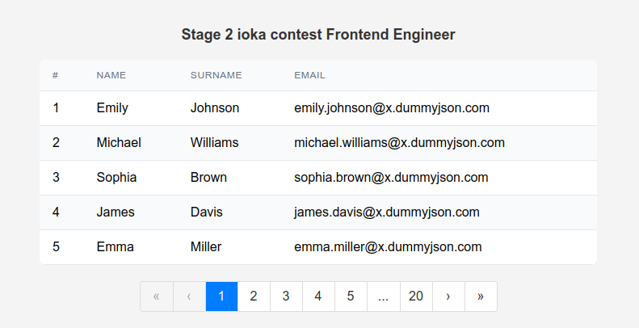

# Pagination Component

This project is a responsive `React` application that implements a pagination component alongside a data table. The pagination component is built using `TypeScript` and `SCSS`, adhering to modern web development standards. It includes adaptive features for different screen sizes, ensuring a seamless user experience on both desktop and mobile devices.

This README provides an overview of the project, instructions for setup and running, and highlights the key features implemented as part of the test assignment.



## Requirements

- Separation of logic from UI
- Pagination display
- Custom responsive design

## Navigation

- Go forward 1 page
- Go back 1 page
- Go forward by several pages
- Go back several pages

## Part 2 - OOP Class

- This class encapsulates the state and pagination methods
- The class is independent of the framework

# Setup and Installation

## Prerequisites:

- You need `Node.js` and `npm` installed on your machine.

## Steps:

1. Clone the repository:
```bash
git clone <repository-url>
cd <repository-directory>
```
2. Install the dependencies:
```bash
npm install
```
3. Start the development server:
```bash
npm start
```

## Available Scripts

In the project directory, you can run:

### `npm start`

Runs the app in the development mode.\
Open [http://localhost:3000](http://localhost:3000) to view it in the browser.

The page will reload if you make edits.\
You will also see any lint errors in the console.

### `npm test`

Launches the test runner in the interactive watch mode.\
See the section about [running tests](https://facebook.github.io/create-react-app/docs/running-tests) for more information.

### `npm run build`

Builds the app for production to the `build` folder.\
It correctly bundles React in production mode and optimizes the build for the best performance.

The build is minified and the filenames include the hashes.\
Your app is ready to be deployed!

See the section about [deployment](https://facebook.github.io/create-react-app/docs/deployment) for more information.